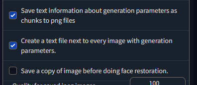

# Output on Auto's UI
1. Go to settings and check the following to generate tags. This script will not work without it!

2. Place the PNG files and TXT files in the same dir ./images
3. After processing they will go to ./imported

# Setup on Hydrus Client API
1. Get your client access key under "services"
2. "review services"
3. "client api" tab 
4. add a client
5. click "copy api access key" on the bottom right
6. add it as an OS environment variable or in your IDE or just remove that code and hardcode it here: `secret_key = {'Hydrus-Client-API-Access-Key': key}`
6. if your client api is working it should be accessible at http://127.0.0.1:45869

# TODO
- [ ] Integrate into Auto's UI
- [x] Move imported files into an `imported` folder
- [x] Fix unix paths
- [ ] Integrate deepdanbooru tagging as an optional feature
- [ ] Make tags better (tag list?)

# Current Limitations
* Only supports alphanumeric characters, but adds the prompt as a seperate tag 
* Comma deliminated so you might get tags like "a" or "this"